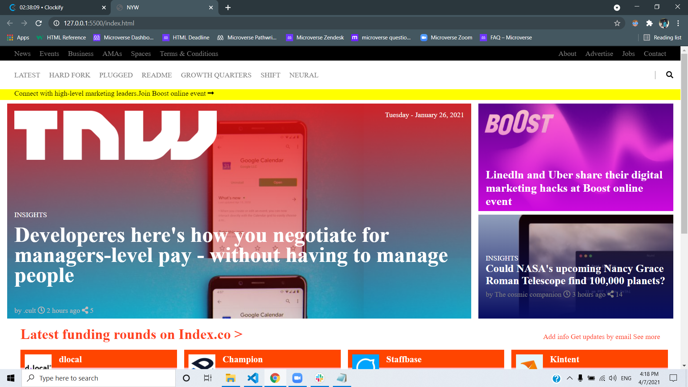

# ResponsivePerma
Project 2: Building with Responsive Design.
 
This Project is a clone of the New Web page (https://thenextweb.com/)
 

 
 
## Built With
- HTML
- CSS
- Coffee
 
## Live Demo
[Live Demo Link] ()
 
# Authors
 
- GitHub: @aliabbani (https://github.com/aliabbani) 
         
- Twitter: @aliabbani 
           
- LinkedIn: @ali abbani (https://www.linkedin.com/in/ali-abbani-8b6246150/) 
 
# Authors2
 
- GitHub: @Ajise Toluwase (https://github.com/Whoistolu)
         
- Twitter: @littletolu
           
- LinkedIn: @Toluwase Ajise(https://www.linkedin.com/in/toluwase-ajise-9b40411b2/)
            
## 🤝 Contributing
 
Contributions, issues, and feature requests are welcome!
 
Feel free to check the [issues page](issues/).
 
## Show your support
 
Give a ⭐️ if you like this project!
 
## Acknowledgments
 
- Hat tip to anyone whose code was used
- Inspiration
- etc
 
## 📝 License
 
This project is [MIT](lic.url) licensed.
=======
 